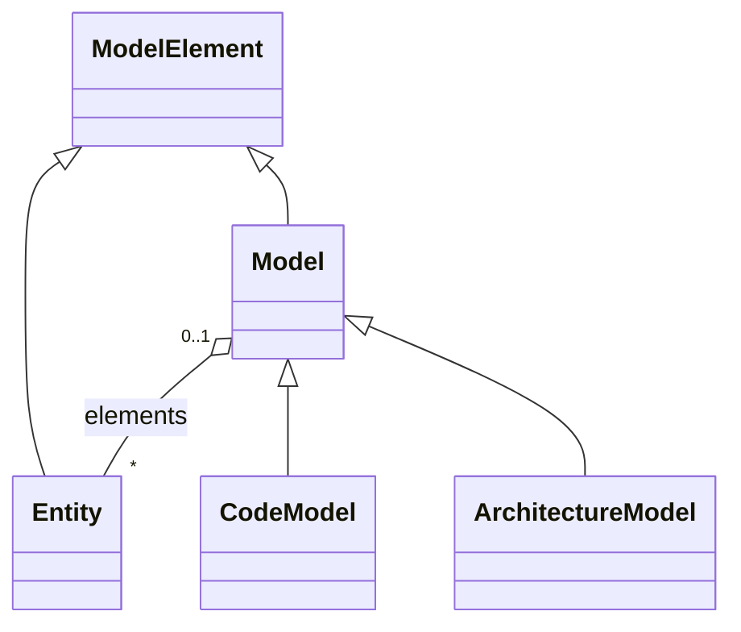
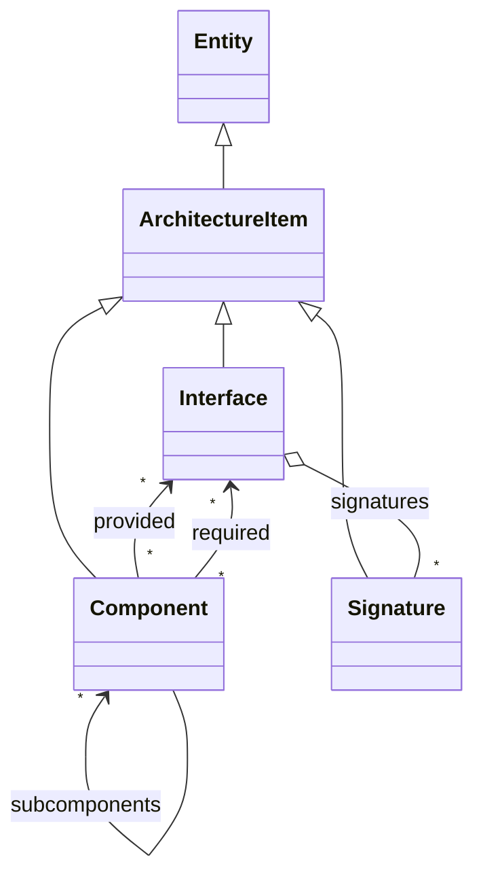
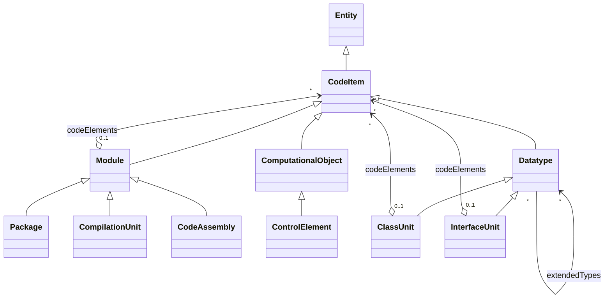

Currently, there are three kinds of intermediate artifacts.
First, the input text has an internal representation (cf. [edu/kit/kastel/mcse/ardoco/core/api/text/Text.java](https://github.com/ArDoCo/Core/blob/main/framework/common/src/main/java/edu/kit/kastel/mcse/ardoco/core/api/text/Text.java)) to cover all the annotations from the preprocessing.
Second, there is the intermediate representation of software architecture models (SAMs) that we cover [below](#software-architecture-models).
Third, we create a uniform representation for code that we also explain [below](#code).

## Software Architecture Models

In this software model, each class is categorized as an ArchitectureItem, which inherits properties from Entity, including a name and identifier.
There are three types of ArchitectureItems: Component, Interface, and Signature.

A Component represents various architectural elements in different modeling languages.
For instance, it corresponds to a UML Component.
In the PCM context, it encompasses both BasicComponent and CompositeComponent.
BasicComponents do not contain sub-components, while CompositeComponents may have sub-components.

Components can either require or provide Interfaces.
Provided Interfaces are implemented by the Component, while Required Interfaces specify the functionality required by a Component.

An Interface contains multiple method Signatures.
Signatures are linked to Interfaces in a composite relationship, meaning each Signature is associated with an Interface.

## Code

The intermediate model for code is based on the source code package within the [Knowledge Discover Model (KDM)](https://www.omg.org/spec/KDM/1.3/PDF).

The different classes in the code model inherit from CodeItem, which itself is a specialized Entity.
Thus, each class has a name and identifier.

There are three kinds of source code elements: Module, Datatype, and ComputationalObject.

Modules are typically logical components of the system with a certain level of abstraction.
A Module can contain CodeItems, and there are three differentiations of Modules: CompilationUnit, Package, and CodeAssembly.

A CompilationUnit represents a source file where code is stored.
It includes a relative path to the file's location on disk and its programming language.
The CompilationUnit is partly based on the InventoryModel from KDM.

A Package is a logical collection of source code elements (i.e., CodeItems).
Packages can also contain sub-Packages, similar to the structure commonly found in Java.

A CodeAssembly consists of source code artifacts linked together to make them runnable.
For example, source code files together with their headers are grouped in a CodeAssembly.

There are two kinds of Datatypes: CodeUnit and InterfaceUnit.
A CodeUnit is akin to a class in Java and can contain other CodeItems like methods and inner classes.
Similarly, an InterfaceUnit can also contain code elements like methods.

The relationships implementedTypes and extendedTypes from the KDM model are present in the intermediate model.
A Datatype can implement an arbitrary number of extendedTypes relations, representing inheritance in object-oriented programming languages.

The construction around extendedTypes and implementedTypes also enables interfaces to extend other interfaces, akin to Java.
Interfaces can also extend classes, a feature present in some programming languages like TypeScript.

The KDM includes several primitive datatypes like boolean, which are not realized within this model as they are not currently needed.
If future work extends the approaches with a thorough comparison of datatypes, then the intermediate model may need further sub-classing of the KDM.

Currently, there is only one type of ComputationalObject: the ControlElement.
The ControlElement represents callable parts with specific behaviors, such as functions, procedures, or methods.
Unlike the KDM, this work does not make a further distinction between CallableUnits and MethodUnits.
Additionally, it does not utilize parameters, return types, or similar elements of the KDM and therefore does not model them.
