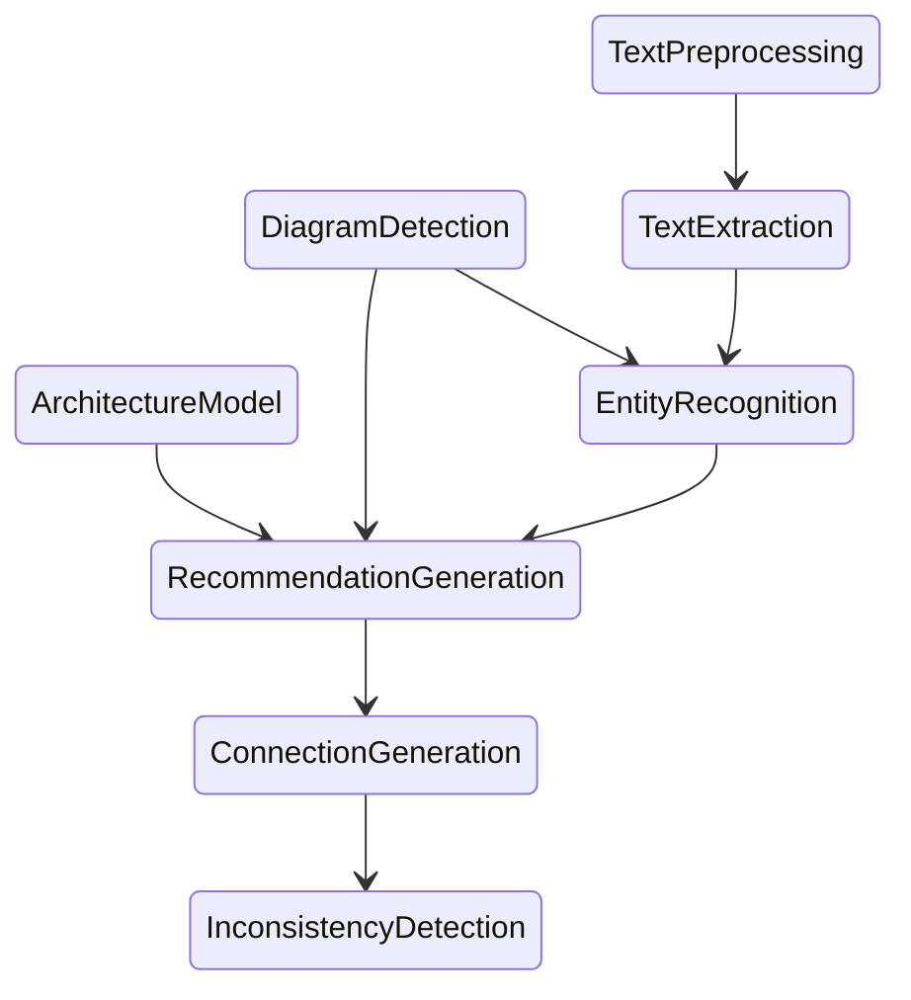

# Linking Sketches and Software Architecture (LiSSA)

The LiSSA approach aims to connect sketches and informal diagrams (such as class diagrams, component diagrams, ...) with
formal models like component models.

The following diagram shows the pipeline that is planned for the LiSSA approach.

