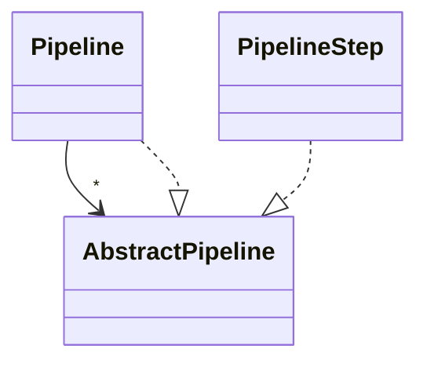

For the pipeline definition, we use a composite to allow us to have a multi-level pipeline.
As such, a pipeline consists of an arbitrary number of either *PipelineStep*s or further *Pipeline*s.

In our approach, we use three levels for our pipeline:
On the first level, the overall pipeline defines multiple *stages*, e.g., text preprocessing or element connection.
Each stage is another pipeline that then defines *agents* that have the purpose of initiating the processing and of collecting the information of the various heuristics.
Agents then use *Informants* as concrete PipelineSteps to execute the processing and heuristics.

A pipeline step (i.e., an Informant) stores results within a repository that can be universally accessed by all pipeline steps, similarly to a blackboard in the blackboard pattern.
This way, each pipeline step and, thus, each heuristic can access the results of previous steps and provide its results for others.
