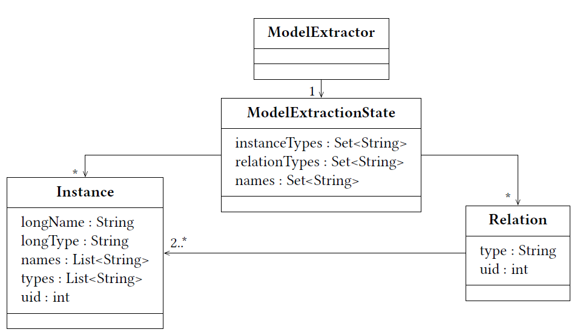

Model
==========

.. warning:: This site is deprecated and currently built up

Model Extraction State
-------------------------

The model is stored in the `Model Extraction State <https://github.com/ArDoCo/Core/blob/main/src/main/java/modelconnector/modelExtractor/state/ModelExtractionState.java>`_.
The state stores `Instances <https://github.com/ArDoCo/Core/blob/main/src/main/java/modelconnector/modelExtractor/state/Instance.java>`_ and `Relations <https://github.com/ArDoCo/Core/blob/main/src/main/java/modelconnector/modelExtractor/state/Relation.java>`_.
Instances consist of a ``_longName_`` that contains the longest identifier of the instance (e.g. car wheel).
Other, possibly names (for example wheel) can be stored in the ``_names_ list``.
To ensure traceability the unique identifier of the model element is stored in the ``_uid_``.
Relations are compositions of Instances.
The type of a Relation can be used to mark the kind of the Relation in the model (e.g. in UML: Aggregation/ Association).

Metamodel
___________

Instance
_____________

Relation
______________
