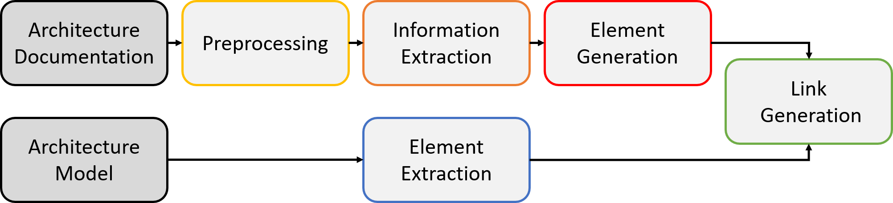

Pipeline
===============

ArDoCo recognizes inconsistencies between a model and a documentation.
Therefore, it is divided into multiple steps that can be seen as pipeline:

The image shows the idea and processing of the approach.
Text and models are given as input.

If the text is not yet preprocessed, it is done via `INDIRECT <https://ps.ipd.kit.edu/176_indirect.php>`_.
The goal of the preprocessing is to analyse the text and annotate additional language information to it.
These could be dependencies, name-tags, or found relations between words.

Based on the given documentation ArDoCo first extracts potential entity names, entity types and relations from the text.
This stage is called *text extraction*.

After it, the *recommendation generation* begins.
In this stage, the entity names and types are combined.
To increase the hit rate, we use the meta model as additional input for this phase.
Thereby, potential types are easier to detect.
The name-type combinations are traded as instances on the textual site.
Thereby, ArDoCo is able to recommend textual instances as potential trace links without knowledge of the instantiated model.

In the following *connection generation*, ArDoCo has access to the instantiated model and creates trace links between the recommended instances/ relations and the entities in the models.

The last stage is the *inconsistency generation*.
In this stage, ArDoCo identifies entities without trace links as inconsistent states.

The respective `pipeline class <https://github.com/ArDoCo/Core/blob/main/pipeline/src/main/java/edu/kit/kastel/mcse/ardoco/core/pipeline/Pipeline.java>`_ is located in the `core module <https://github.com/ArDoCo/Core/>`_.

Input
------------
The pipeline works with a single data structure for all steps: the :doc:`data structure <datastructures>`.
The *data structure* is filled with the information of the executed steps.
Then it is passed on through the pipeline.
Therefore, when the pipeline is instantiated, the prerequisites, a text in natural language and a readable model, have to be loaded into it.
The pipeline is executed via the method `runAndSave <https://github.com/ArDoCo/Core/blob/3b62cc78f0a9d4c60dc75796a401d83665f219f1/pipeline/src/main/java/edu/kit/kastel/mcse/ardoco/core/pipeline/Pipeline.java#L75>`_).

Text
^^^^^^^^^^
In a first step, the text should be given via a .txt file.
It should not contain any images, tables, or listings.
It is preprocessed via `INDIRECT <https://ps.ipd.kit.edu/176_indirect.php>`_.
The results of the preprocessing are stored as an annotated text.
This text is then used as base for the rest of the approach

If you want to enter a preprocessed text, it should be stored in `JSON <https://en.wikipedia.org/wiki/JSON#:~:text=JSON%20(JavaScript%20Object%20Notation%2C%20pronounced,(or%20other%20serializable%20values).>`_ format.
so that the `JsonTextProvider <https://github.com/ArDoCo/Core/blob/3b62cc78f0a9d4c60dc75796a401d83665f219f1/text-provider/src/main/java/edu/kit/kastel/mcse/ardoco/core/text/providers/json/JsonTextProvider.java#L52>`_ is able to extract the text and the annotations.
Notice, that some steps of the project depend on specific annotations, like pos-tags, dependencies, etc.!

.. seealso:: For more information read the documentation about :doc:`the textual data <data/textData>`.

Models
^^^^^^^^^^^^
ArDoCo can handle architectural and code models.
Models are read out using the suitable *model connector*.

In case of architectural models, this is the `PCM model connector <https://github.com/ArDoCo/Core/blob/3b62cc78f0a9d4c60dc75796a401d83665f219f1/model-provider/src/main/java/edu/kit/kastel/mcse/ardoco/core/model/pcm/PcmXMLModelConnector.java#L22>`_.
The connector requires a `PCM (Palladio Component Model) <https://www.palladio-simulator.com/science/palladio_component_model/>`_ in XML format.
Other connectors, for example, for other types of architectural models, can be defined analogously.

In case of code models, the `Java model connector <https://github.com/ArDoCo/Core/blob/3b62cc78f0a9d4c60dc75796a401d83665f219f1/model-provider/src/main/java/edu/kit/kastel/mcse/ardoco/core/model/java/JavaJsonModelConnector.java#L25>`_ extracts the classes and interfaces of the model.
Please note that we currently focus rather on instances than on relations.
Thereby, the extraction between the classes/ interfaces are currently not implemented.
Just like for architectural models, other code models can be used if additional connectors are provided.

The recognized instances and relations are written to the output directory if one was specified in the :doc:`CLI <quickstart/cli>`.

.. seealso:: For more information read the documentation about the :doc:`model connectors <stages/modelExtraction>` and :doc:`the model data <data/modelData>`.

Pipeline Stages
-----------------------

The agile design enables to rearrange or replace each step of the pipeline.
Thereby, the parts of it can be exchanged or reused in other ways.

After the initial *data structure* was created, the other steps of the pipeline are executed.
Every stage is executed as an *execution stage*.
Every *execution stage* uses different *agents* to fulfill its function.

Every agent has a specific goal (e.g. the detection of named entities).
To fulfill this task an agent can have multiple *extractors*.
Extractors run over the annotated text and extract needed information for the current stage.

In contrast to them, general *agents* base only on the extracted data of previous stages, but do not go over the whole text.
However, some stages (esp. the text extraction) need to look on the preprocessed text.
Therefore, these stages have agents that contain extractors.
To ensure that these extractors run before every other (maybe) on their result basing agents, they are commonly named *initialAgent* and executed before any other agents.

.. hint:: This should be refactored for the 0.4 release

Text Extraction
^^^^^^^^^^^^^^^^^^
The :doc:`text extractor<stages/textExtraction>` depends on the annotated input text.
It uses PosTags, DependencyTags, and other information, as described in the :doc:`preprocessing section <stages/textPreprocessing>`
Currently most agents of this stage use heuristics to detect possible instances and relations.

The extracted information are stored in the :doc:`text extraction state <data/textextractionData>`.

The text extraction should thin out unnecessary information by extracting all possibly relevant instances and relations.
However, since the later steps rely on this step, the recall of this step should be kept high, whereas a high precision is less important.

Recommendation Generation
^^^^^^^^^^^^^^^^^^^^^^^^^^^^^^^^^^

The :doc:`recommendation generator <stages/recommendationGeneration>` requires the :doc:`annotated text <data/textData>`, the :doc:`extracted text data <data/textData>`, and the :doc:`metamodel <data/modelData>`.
The goal of the recommendation generation is to build potential elements that could occur in the model.
The properties of the elements depend on the underlying meta model (respectively the properties of its elements).
The elements can be instances (e.g. UML classes), as well as relations between instances.
The recommendation generator represents the element generation of the theoretical pipeline.
Its results are stored in the :doc:`recommendation state <data/recommendationData>` of the :doc:`data structure <datastructures>`.

.. seealso:: For more information read the documentation about :doc:`the recommendation generator <stages/recommendationGeneration>`.

Connection Generation
^^^^^^^^^^^^^^^^^^^^^^^^^^
The connection generation connects the recommended entities to the entities of the given model.
Thus, it creates trace links between the input text and model.
The links are stored in the :doc:`connection state <data/connectionData>`.

.. seealso:: For more information read the documentation about :doc:`the connection generator <stages/connectionGeneration>`.

Inconsistency Generation
^^^^^^^^^^^^^^^^^^^^^^^^^^
The inconsistency generation is the last stage of the pipeline.
It makes a comparison between the found trace links and the entities of the model.
Thereby, it recognizes inconsistencies caused by missing mentions of model entities.

.. seealso:: For more information read the documentation about the :doc:`inconsistency generator <stages/inconsistencyGeneration>`.

