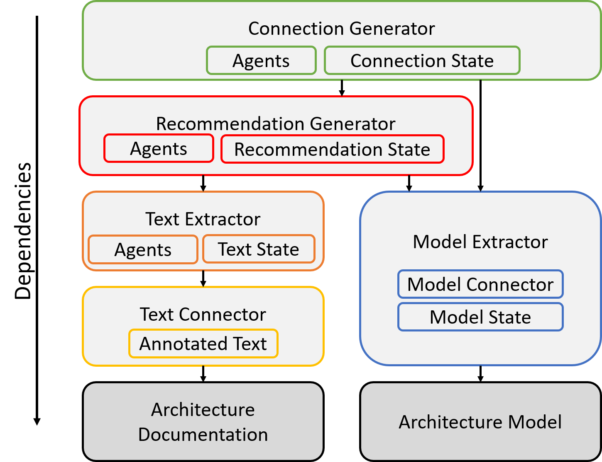
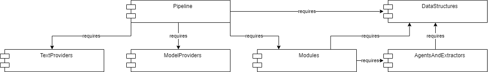

Stages
======

.. warning:: This site is deprecated

As described in the [Overview](https://github.com/ArDoCo/Core/wiki/Overview), every stage of the approach is represented by a different component.
In this section of the wiki, the common principles of these parts are described.

A commonality between all of these stages is that every module contains agents (except for the Model Extractor).
Agents are executables (in the modules) that extract information for the current stage based on the given knowledge.
This knowledge includes the information of the current state.
Since some agents reuse the gained knowledge of agents of the same stage, (mostly) a specific agent (initial agent) should be executed before the others.
This agent usually contains extractors.
Extractors only depend on the knowledge below their stage and fill the state of the current stage.
Afterwards, other agents can use these knowledge for their tasks.
Furthermore, agents can edit/change the entries of the state.
However, the state has the choice how its entries are changed.
Therefore, the agents deliver their results combined with a probability to the state.

The next image shows an examplary class diagram of a module - in this case the text extractor.

The text extractor implements the IAgentModule (the module interface from the approach).
Moreover it has an agent datastructure and text agents.
The agent datastructure capsules the states of all modules.
If some states have not been set (when their module was not executed yet) the state is not accessible.
The text extractor runs the text agents on the current datastructure.
Afterwards, the agent datastructures can be requested by the getState() method.
As explained before, each module has multiple agents that run in a specified sequence.
This can be set in the configuration of the module.
The agents themselves have a configuration file, too.
In it, different valuations can be set.
To enable the parallelization of agents and to use consistent sequences, agents have an dependency type.
The dependency type encodes the states on which an agent is dependent.

.. toctree::
   :hidden:

   stages/textPreprocessing
   stages/textExtraction
   stages/modelExtraction
   stages/recommendationGeneration
   stages/connectionGeneration
   stages/inconsistencyGeneration