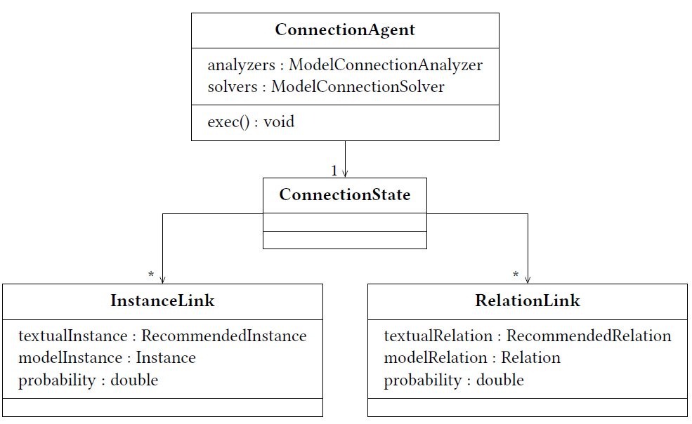

Connection Generation
===========================

.. warning:: This site is deprecated

As described in the `Overview <https://github.com/ArDoCo/Core/wiki/Overview>`_, the `Connection Agent <https://github.com/ArDoCo/Core/blob/main/src/main/java/modelconnector/connectionGenerator/ConnectionAgent.java>`_ creates connections between elements (extracted from the model) and textually identified elements.
The goal in this stage is to identify similar elements on both sides.

The agent has a state and multiple analyzers/ solvers.
The analyzer/ solvers and their parameters can be specified in the `configuration <https://github.com/ArDoCo/Core/blob/main/src/main/resources/config.properties>`_.
The `Connection State <https://github.com/ArDoCo/Core/blob/main/src/main/java/modelconnector/connectionGenerator/state/ConnectionState.java>`_ is a blackboard and stores all results of the analyzers/ solvers of the agent.

Analyzers
---------------
Currently, the Connection Generator has no analyzers.

Solvers
---------
Instance Connection Solver
^^^^^^^^^^^^^^^^^^^^^^^^^^^^^^^^^^
`Instance Connection Solver <https://github.com/ArDoCo/Core/blob/main/src/main/java/modelconnector/connectionGenerator/solvers/InstanceConnectionSolver.java>`_:
This solver connects recommended instances and model instances.
For this, it runs through the model instances of the model extraction state.
Then, it runs over the recommended instances of the recommendation state to find suggested instances with a similar name.
For the recommended instances with the most similar name, an instance link is added to the connection state.
If there are multiple, most similar recommended instances, links are created for all of them.
For recommended instances, without a specified type, the probability is decreased.
Thus, instance links that include a type specification are preferred.

Relation Connection Solver
^^^^^^^^^^^^^^^^^^^^^^^^^^^^^^^^^^^^
`Relation Connection Solver <https://github.com/ArDoCo/Core/blob/main/src/main/java/modelconnector/connectionGenerator/solvers/RelationConnectionSolver.java>`_:
The relation connection solver works similar to the instance connection solver.
Instead of connecting instances, it connects relations.
Therefore, it searches for every model relation, a corresponding recommended relation.
If both relations have different amounts of participating instances, the search is continued with another recommended instance.
If the amount is the same, the instance references have to be compared.
For the recommended relation under examination, all instances of its participants are collected that are most similar to the instances of the model relation.
Thereby, multiple combinations of relations with the most similar participants are created.
If for every (model) instance participant exactly one corresponding recommended instance exists, the relation link between both is added to the connection state.
The order of the participants is matched to the model relation.
If no match can be found, it is tried to find a recommended relation that has the participants in the wrong way round.