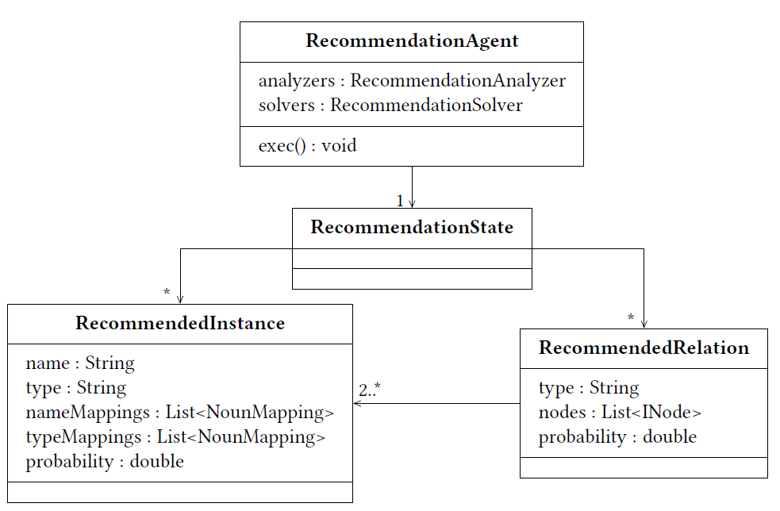

Recommendation Generation
===========================

.. warning:: This site is deprecated

As described in the `Overview <https://github.com/ArDoCo/Core/wiki/Overview>`_, the `Recommendation Agent <https://github.com/ArDoCo/Core/blob/main/src/main/java/modelconnector/recommendationGenerator/RecommendationAgent.java>`_ creates recommendations for model elements based on the textual knowledge.
Herefore, it has access to the extracted model.
However, in this layer, the agent should not connect textual elements and model elements but can use model information to increase the certainty of some elements (e.g. by meta-model information).
The agent has a state and multiple analyzers/ solvers.
The analyzer/ solvers and their parameters can be specified in the `configuration <https://github.com/ArDoCo/Core/blob/main/src/main/resources/config.properties>`_.
The `Recommendation State <https://github.com/ArDoCo/Core/blob/main/src/main/java/modelconnector/recommendationGenerator/state/RecommendationState.java>`_ is a blackboard and stores all results of the analyzers/ solvers of the agent.

Analyzers
-------------

Extraction Dependent Occurrence Analyzer
^^^^^^^^^^^^^^^^^^^^^^^^^^^^^^^^^^^^^^^^^^^^
`Extraction Dependent Occurrence Analyzer <https://github.com/ArDoCo/Core/blob/main/src/main/java/modelconnector/recommendationGenerator/analyzers/ExtractionDependentOccurrenceAnalyzer.java>`_:
This analyzer uses model information to find referenced model instances.
For every node is checked, whether it could be a name or a type of a model instance.
If similar model instance names (or types) are found, they are added as noun mappings of their kind to the text extraction state.
This analyzer should run before any other analyzers or solvers are processed since it extends the underlying knowledge base.

Name Type Analyzer
^^^^^^^^^^^^^^^^^^^^^^
`Name Type Analyzer <https://github.com/ArDoCo/Core/blob/main/src/main/java/modelconnector/recommendationGenerator/analyzers/NameTypeAnalyzer.java>`_:
The NameTypeAnalyzer searches for patterns of name and types.
If these patterns occur, it creates recommendations out of the combination.
In general, the analyzer should not question the results of the text extractor.
For that reason, only combinations between names and types (and no types and types, or names and names) are built up to RecommendedInstances.
However, the analyzers can use norts in exchange for names.
The use of norts does not doubt the classification of the text extraction state, since it could not unambiguously classify the nort as name or type.
Current combinations are: ``name type``, ``nort type``, ``type name``, and ``type nort``.

Extracted Terms Analyzer
^^^^^^^^^^^^^^^^^^^^^^^^^^
`Extracted Terms Analyzer <https://github.com/ArDoCo/Core/blob/main/src/main/java/modelconnector/recommendationGenerator/analyzers/ExtractedTermsAnalyzer.java>`_:
This analyzer uses terms of the text extraction state to create recommendation names and types of multiple words, like ``car wheel`` of type ``common component``.
For more information have a look at the sources.

Solvers
---------

Reference Solver
^^^^^^^^^^^^^^^^^^^^
`Reference Solver <https://github.com/ArDoCo/Core/blob/main/src/main/java/modelconnector/recommendationGenerator/solvers/ReferenceSolver.java>`_:
The ReferenceSolver combines information from textual and model resources.
As textual resources, the noun mappings of the text extraction state are used.
Their reference represents a unified term for all words stored in the mapping.
As a model equivalent, instances from the model extraction state are used.

Separated Relations Solver
^^^^^^^^^^^^^^^^^^^^^^^^^^^^
`Separated Relations Solver <https://github.com/ArDoCo/Core/blob/main/src/main/java/modelconnector/recommendationGenerator/solvers/SeparatedRelationsSolver.java>`_:
The SeparatedRelationsSolver is a solver that creates RecommendedRelations.
Sometimes, punctuation marks occur in architecture documentation to specify the location of an element.
For example: “Component c is contained by layer.ai”.
In this case, component c is part of ai that lies in a layer.
In the context of this work, these specific punctuation marks are called separators.
They can be defined in a configuration file.
For each, the solver checks if an included name noun mapping contains an occurrence with a separator.
