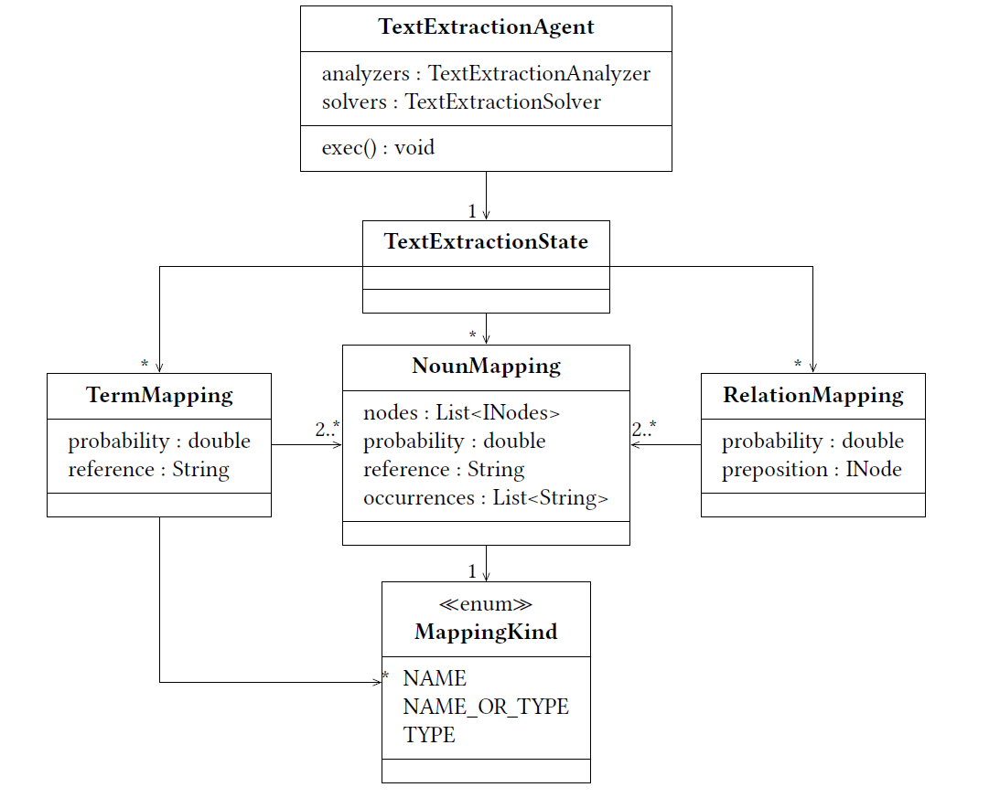

Text Extractor
=================

.. warning:: This site is deprecated

Preprocessing
---------------
As described in the `Overview <https://github.com/ArDoCo/Core/wiki/Overview>`_ the goal of the Text Extraction is to extract all possibly relevant information from the text.
The text is preprocessed by INDIRECT.
Further analysis depends on some linguistic information (e.g. dependencies).
To add this information to the PARSE graph, the corresponding INDIRECT agents have to be executed in the preprocessing.

Text Extraction Agent
------------------------
The interface for the text extraction is the `Text Extraction Agent <https://github.com/ArDoCo/Core/blob/main/src/main/java/modelconnector/textExtractor/TextExtractionAgent.java>`_.
The agent has a state and multiple analyzers/ solvers.
The analyzer/ solvers and their parameters can be specified in the `configuration <https://github.com/ArDoCo/Core/blob/main/src/main/resources/config.properties>`_.
The `Text Extraction State <https://github.com/ArDoCo/Core/blob/main/src/main/java/modelconnector/textExtractor/state/TextExtractionState.java>`_ follows the blackboard principle and stores all results of the Text Extraction Agent.
It can be changed by the analyzers/ solvers of the Text Extraction State, as well as dependent analyzers/ solvers.
Thereby, the results of this step can be corrected by further analysis in later steps.

Analyzers
-----------

NounAnalyzer
^^^^^^^^^^^^^^^^
`Noun Analyzer <https://github.com/ArDoCo/Core/blob/main/src/main/java/modelconnector/textExtractor/analyzers/NounAnalyzer.java>`_:
The goal of the Noun Analyzer is to find and extract the nouns.
For this, it uses the POS (Part Of Speech) tags of the PARSE graph.
INDIRECT uses the nltk tagset.

Dependency Analyzers
^^^^^^^^^^^^^^^^^^^^^^
`Incoming Dependency Arcs Analyzer <https://github.com/ArDoCo/Core/blob/main/src/main/java/modelconnector/textExtractor/analyzers/InDepArcsAnalyzer.java>`_:
The Incoming Dependency Arcs Analyzer checks the incoming dependency edges of the PARSE graph, created with the Dependency Parser agent of INDIRECT.

`Outgoing Dependency Arcs Analyzer <https://github.com/ArDoCo/Core/blob/main/src/main/java/modelconnector/textExtractor/analyzers/OutDepArcsAnalyzer.java>`_:
This analyzer checks the outgoing dependency edges of a node.
For this, the edges have to be created first by the Dependency Parser of INDIRECT.

Separated Names Analyzer
^^^^^^^^^^^^^^^^^^^^^^^^^^
`Separated Names Analyzer <https://github.com/ArDoCo/Core/blob/main/src/main/java/modelconnector/textExtractor/analyzers/SeparatedNamesAnalyzer.java>`_:
The separated names analyzer identifies nodes containing separators.
Then it adds it as noun mapping of kind name to the extraction state.
Examples for this would be: intelligence::ai or car.wheel.
Then, the method adds each part is separately to the text extraction state.
The separators for that process are stored in a configuration file.

Article-Type-Name Analyzer
^^^^^^^^^^^^^^^^^^^^^^^^^^^^
`Article-Type-Name Analyzer <https://github.com/ArDoCo/Core/blob/main/src/main/java/modelconnector/textExtractor/analyzers/ArticleTypeNameAnalyzer.java>`_:
This analyzer checks the current node and its surrounding for two specified patterns.
In both cases the current node has to be previously classified as a nort (or more specific kind).
After the classification, a noun mapping of the concluded mapping kind is created.

Article Type Name:
If the previous node of the input is a type and the predecessor of that one is an article, the current node is classified as a name.
For example “The component a is ...”

Article Name Type:
If the previous node is a name and the predecessor of that is an article, the current node is classified as a type.
For example “The ai component is ...”

Solvers
--------
Multiple Part Solver
^^^^^^^^^^^^^^^^^^^^^^^^
`Multiple Part Solver <https://github.com/ArDoCo/Core/blob/main/src/main/java/modelconnector/textExtractor/solvers/MultiplePartSolver.java>`_:
This solver identifies terms in the current extraction state.

